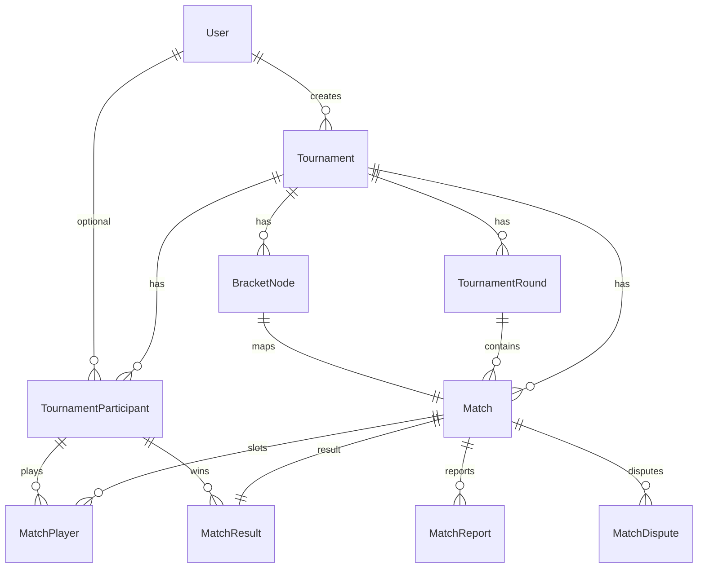
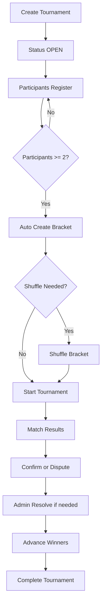

# Duel Standby - Tournament Feature Report

Date: 2026-03-14
Owner: Duel Standby Engineering
Status: Development

## Executive Summary
This report documents the tournament feature end-to-end for Duel Standby, covering backend architecture, API surface, frontend UI, and workflow lifecycle. It reflects the current implementation in the repository and serves as a baseline for QA, product review, and future scaling.

## Scope
- Tournament lifecycle: create, register, bracket creation, shuffle, start, result management.
- Participant management: user and guest participants.
- Bracket engine: single elimination, double elimination, swiss.
- Admin controls: bracket view, shuffle, match admin actions.
- Public views: tournament detail and bracket view.

## Architecture Overview
- Backend: Next.js App Router API routes + Prisma ORM + MySQL/MariaDB.
- Frontend: Next.js App Router, React, DaisyUI, react-tournament-brackets.
- Bracket engine: generate, sync, and rebuild flows implemented in a shared service.

## Data Model (Mini ERD)


## Core Entities
- Tournament
  - status: OPEN, ONGOING, COMPLETED, CANCELLED
  - structure: SINGLE_ELIM, DOUBLE_ELIM, SWISS
  - maxPlayers: kapasitas maksimal peserta (opsional)
- TournamentParticipant
  - userId optional for guest
  - guestName optional for non-user participants
  - gameId snapshot of IGN
  - seed and seededAt for bracket seeding
- TournamentRound and Match
  - roundNumber and round type
  - match status lifecycle and scores
- MatchResult, MatchReport, MatchDispute
  - result confirmation and admin overrides
- BracketNode
  - supports tree navigation and frontend bracket rendering

## Backend API Surface
All endpoints are under `app/api/tournaments`.

Tournament:
- GET /api/tournaments
- POST /api/tournaments
- GET /api/tournaments/[id]
- PUT /api/tournaments/[id]
- DELETE /api/tournaments/[id]

Participants:
- POST /api/tournaments/[id]/register
- GET /api/tournaments/[id]/participants
- POST /api/tournaments/[id]/participants
- POST /api/tournaments/[id]/participants/bulk
- PATCH /api/tournaments/[id]/participants/[participantId]
- DELETE /api/tournaments/[id]/participants/[participantId]
- POST /api/tournaments/[id]/participants/[participantId]/check-in

Bracket:
- GET /api/tournaments/[id]/bracket (public, no auth)
- GET /api/tournaments/[id]/seeds
- POST /api/tournaments/[id]/start
- POST /api/tournaments/[id]/shuffle

Matches:
- GET /api/tournaments/[id]/matches
- POST /api/matches/[id]/report
- POST /api/matches/[id]/confirm
- POST /api/matches/[id]/admin-resolve

Notes:
- Endpoint register dan match report memiliki rate limit per user untuk mencegah abuse.

Announcements:
- GET /api/tournaments/[id]/announcements
- POST /api/tournaments/[id]/announcements
- PATCH /api/tournaments/[id]/announcements/[announcementId]
- DELETE /api/tournaments/[id]/announcements/[announcementId]

## Bracket Engine
Service location: `lib/services/tournament-bracket.service.ts`

Key capabilities:
- generateTournamentBracket: creates rounds, matches, and seeds.
- syncTournamentRosterToBracket: fills empty round-1 slots.
- syncOrCreateTournamentBracket: auto-creates bracket if absent and participants >= 2.
- rebuildTournamentBracket: rebuilds bracket from current participants for shuffle.

Status behavior:
- Bracket auto-creates once participants reach minimal 2.
- Shuffle is allowed only while status is OPEN.
- Start moves tournament to ONGOING, without rebuilding if bracket exists.

## Workflow (Main Lifecycle)


## Frontend UI Summary
Public:
- Tournament list and detail page.
- Bracket viewer (react-tournament-brackets).
- Register button with status update.
  - Bracket public hanya mengembalikan data yang dibutuhkan (tanpa ID peserta internal).

Admin:
- Tournament list with quick actions.
- Bracket admin view with seed list, zoom, and shuffle.
- Participants management with add guest and bulk add.
- Match admin modal for score input and winner selection.

## Current UX Notes
- Bracket supports fullscreen and zoom with themed rendering.
- Seeds are visible in admin to validate seeding order.
- Guest participants are allowed via admin flows.

## Known Limitations
- maxPlayers wajib selaras ukuran bracket (8/16/32/64/128/256).
- Bracket size masih mengikuti peserta saat create, tapi registrasi akan berhenti saat kapasitas penuh.
- Shuffle rebuilds bracket and resets match history (OPEN only).

## Test Coverage
Unit tests include:
- Bracket sync behavior.
- Bracket auto-create behavior when participants are below minimum.

Test entry point:
- `npm run test:unit`

## Recommendations
- Add a warning banner when pending participants exceed available slots.
- Add admin action to expand bracket size without rebuild (future).

## Appendix - Key Files
- Data model: `prisma/schema.prisma`
- Bracket engine: `lib/services/tournament-bracket.service.ts`
- Admin bracket UI: `components/dashboard/tournament-bracket-admin.tsx`
- Admin tournament list: `app/dashboard/tournaments/page.tsx`
- Public detail: `app/tournaments/[id]/page.tsx`
```
